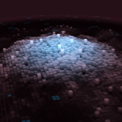

# Sonic Topography Extended



An extended, music-reactive 3D terrain wallpaper for Wallpaper Engine, built with React, Three.js, React Three Fiber and GLSL.

This project is a modified and extended version of **Sonic Topography** by **CmzYa**:
https://github.com/CmzYa/sonic-topography

It keeps the original visual concept while adding a stereo-aware audio engine, smoother temporal response, rhythm analysis, spectral memory, stereo spatialization, terrain coherence and music-reactive lamp panels.

> This is a modified GPL-3.0 release and is not presented as an official release by the original author. See [`NOTICE.md`](NOTICE.md) and [`ACKNOWLEDGEMENTS.md`](ACKNOWLEDGEMENTS.md).

## Features

- True 64-bin stereo-aware analysis from Wallpaper Engine's left/right spectrum channels
- Smooth frame-rate-independent visual attack and release
- Adaptive onset detection and tempo-aware beat tracking
- Beat-synchronized ripples
- Stereo spatialization across the terrain
- Multi-timescale spectral memory
- Music-driven terrain coherence
- Music-reactive colored lamp panels
- Lamp positions re-seeded between musical events
- Bass-heavy center exclusion for lamp accents
- Resolution-aware lamp grouping with 120x120 as the visual reference
- Configurable accent trigger, density, brightness and color source
- Meteors, idle waves, camera controls and media controls
- English-only generated Wallpaper Engine settings

## Build

```powershell
pnpm install
pnpm run build
```

The Wallpaper Engine package is generated in `dist-wallpaper/`.

For local development/deployment, copy `.env.example` to `.env` and set the `WE` path, then run:

```powershell
.\update.ps1
```

## Credits

**Original project and visual concept:** CmzYa  
https://github.com/CmzYa/sonic-topography

**Extended version:** Netesfiu  
https://github.com/Netesfiu/sonic-topography-extended

Detailed credits are in [`ACKNOWLEDGEMENTS.md`](ACKNOWLEDGEMENTS.md).

## Support

If you enjoy the extended version and would like to support continued development:

https://ko-fi.com/netesfiu

Support is entirely optional and does not provide or restrict any rights granted by the GPL-3.0 license.

## License

This project is distributed under the **GNU General Public License v3.0 (GPL-3.0)**. See [`LICENSE`](LICENSE).

The full corresponding source code is provided in this repository. Modified versions must continue to comply with the GPL-3.0 terms and preserve applicable notices and attribution.
